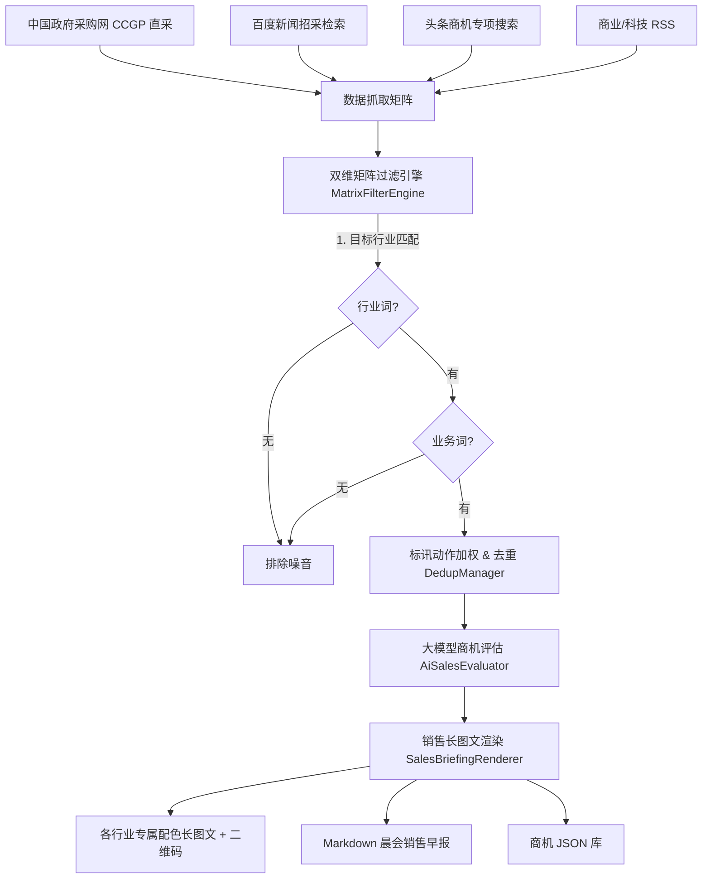

# 💼 Daily Business Information Assistant (每日行业商业与销售情报助手)

<p align="center">
  
  
  
  
  
</p>

<p align="center">
  <b>面向 ToB 企业销售总监、行业线开拓团队与售前专家的开源自动化重大招投标大单检索、商机线索研判与长图文早报系统</b>
</p>

> [!TIP]
> 💡 **给开源开发者的自由定制提示 (100% 自定义)**：  
> 本项目是一套完全解耦的**通用 B2B 销售招采线索挖掘与研判框架**。系统默认预置的“医疗/教育/交通”及“数字化/AI/数据要素/云计算”仅为**开箱演示模板**！  
> **你可以零代码自由更换为你所在企业的业务场景**：只需在 Web 控制台或 `config/config.yaml` 中，简单填写你关注的**客户行业、专属产品维度、政采关键词与采集源**，系统即可秒变你专属领域的销售线索挖掘神器！

---

## 🎯 业务定位与解决的痛点

在企业 ToB 业务开拓中，销售与售前团队每天面临：
1. **行业噪音泛滥**：普通行业新闻过多，绝大多数只提及行业却无核心信息化、系统集成或 AI 采购需求；
2. **商机捕捉滞后**：医疗卫健、教育高校、交通物流、军工国防、电信运营商等大客户的重大标讯、单一来源、集采入围分散在各个招采角落；
3. **一线阅读低效**：文字报表冗长，缺乏关键事实（采购方、中标单位、金额、标的）。

**本项目通过独创的【目标行业 × 业务能力】双维矩阵过滤研判算法 + 大模型商业事实提炼**，每天自动挖掘各大行业核心标讯，生成带有**专属直达二维码**的销售早报长图文。

---

## 🌟 核心特性亮点

- 🎯 **【目标行业 × 业务产品】双维矩阵研判**：
  - 必须同时命中**目标采购行业**（如医疗/教育/交通/军工/运营商/金融）与**核心业务维度**（数字化转型/数据要素/AI应用/云计算基础设施）；
  - 自动识别“中标、入围、招标、采购、单一来源、集采”等强商机动作，并加权标红；
  - 杜绝“某医院开业”或“某通用软件修复漏洞”等单边无效噪音。
- 🔍 **全网商业情报与权威招采直采矩阵**：
  - **中国政府采购网 (CCGP search.ccgp.gov.cn)**：国家财政部直属权威招采发布平台，直采部委、省市、央企大单与采购意向，精准解析采购单位名称；
  - **百度新闻定向搜索**：深度解析真实落地页重定向 URL，抓取时效性极强的各行业采购公告；
  - **头条商机专项搜索**：自动化捕获重点招标、中标公示快报；
  - **垂直招采与商业科技 RSS**：并发订阅行业权威商业源。
- 🤖 **大模型商机事实深度提炼 (免手输 API 地址)**：
  - 内置 **DeepSeek**、**阿里通义千问 (Qwen)**、**月之暗面 (Kimi)**、**Google Gemini**、**OpenAI** 与本地 **Ollama** 官方端点智能解析；
  - 零配置 URL，仅需粘贴 API Key 即可开箱即用（亦支持企业内网反代/聚合网关）；
  - 自动提炼 30 字以内商业事实（采购主体、项目金额、中标方、客户业务诉求）；
  - 配备完整的**本地规则降级引擎**，在断网或无 API Key 时仍能稳定出图。
- 🎨 **销售专版定制视觉长图文**：
  - 针对不同行业应用专属商务色系（医疗浅绿、教育金橙、交通冷灰、军工深褐、通信典雅紫）；
  - 每条商机附带专属扫码直达二维码，扫码即达招采公告与标书原文；
  - 同步输出 Markdown 销售早报与结构化 JSON 数据集。
- 💻 **现代化 Web 驾驶舱 + CLI 双模式**：
  - 内置基于 FastAPI 的现代化深色工作台，提供实时日志推流、矩阵热编辑、政采源自定义、定时任务开关。

---

## 🏗️ 双维研判架构



---

## 🚀 5分钟快速启动

### 1. 安装环境

```bash
git clone https://github.com/stanleygll-lab/Daily_Business_Information_Assistant.git
cd Daily_Business_Information_Assistant

# 创建虚拟环境
python -m venv venv
# Windows 激活:
venv\Scripts\activate
# Linux/macOS 激活:
# source venv/bin/activate

# 安装依赖与浏览器内核
pip install -r requirements.txt
playwright install chromium
```

### 2. 配置环境变量

复制 `.env.example` 为 `.env`：
```bash
cp .env.example .env
```
配置大模型密钥（以 Gemini 为例）：
```env
GEMINI_API_KEY=your_gemini_key_here
```

### 3. 启动模式

#### 模式一：Web 可视化商机驾驶舱 (推荐)
```bash
python app.py
```
访问浏览器：**`http://localhost:8001`**，体验商机一键挖掘、矩阵动态配置、实时日志与长图预览。

#### 模式二：命令行静默执行
```bash
# 执行一次全量商业招采动态抓取
python main.py

# 快速测试（不调用 AI）
python main.py --no-ai

# 开启每日早间 08:30 自动后台推送常驻
python main.py --schedule
```

---

## ⚙️ 配置文件 (`config/config.yaml`) 简述

```yaml
# 1. 目标行业定义 (包含专属色彩与特征词)
industries:
  MEDICAL:
    title: "🩺 医疗卫生数智安全"
    bg: "#E8F5E9"
    border: "#A5D6A7"
    text: "#1B5E20"
    keywords: ["医院", "医疗", "医保", "卫健", "三甲", "智慧医院"]
  EDUCATION:
    title: "🏫 教育高校教学实训"
    keywords: ["学校", "教育", "高校", "大学", "科研院", "教学", "实训"]

# 2. 业务能力维度 (与行业交叉研判)
business_domains:
  DIGITAL_TRANSFORM:
    keywords: ["数字化", "系统集成", "信息化", "信创", "业务中台", "ERP", "CRM"]
  DATA_ASSET:
    keywords: ["数据要素", "数据资产", "数据流通", "数商", "数据确权"]
  AI_INTELLIGENCE:
    keywords: ["AI", "人工智能", "大模型", "智能体", "LLM", "算法"]
  CLOUD_INFRA:
    keywords: ["云计算", "私有云", "服务器", "存储", "IDC", "算力中心", "超融合"]
```

---

## 📁 目录结构

```text
Daily_Business_Information_Assistant/
├── app.py                      # FastAPI Web 工作台服务入口
├── main.py                     # CLI 命令行总入口
├── requirements.txt            # Python 依赖清单
├── .env.example                # 环境变量配置模板
├── .gitignore                  # Git 排除规则
├── LICENSE                     # MIT 开源许可证
├── config/                     # 配置中心
│   ├── config.yaml             # 核心业务配置文件
│   ├── config.example.yaml     # 配置模版
│   └── settings.py             # 配置动态读写与注入
├── core/                       # 核心业务逻辑
│   ├── engine.py               # 商业情报主流水线
│   ├── models.py               # 数据结构模型
│   ├── filter_engine.py        # 行业×业务双维矩阵过滤引擎
│   ├── dedup.py                # 销售商机持久化去重
│   ├── ai_evaluator.py         # 大模型商机事实分析
│   ├── renderer.py             # 销售专版长图文与报告渲染器
│   ├── scheduler.py            # 每日定时调度器
│   └── scrapers/               # 采集驱动
│       ├── base.py             # 爬虫基类
│       ├── ccgp_scraper.py     # 中国政府采购网 (CCGP) 权威招采直采
│       ├── baidu_scraper.py    # 百度新闻招采搜索
│       ├── search_scraper.py   # 头条商机专项搜索
│       └── rss_scraper.py      # 商业/科技 RSS 抓取器
├── web/                        # Web 控制台静态前端
│   └── index.html              # 现代化商机驾驶舱页面
└── tests/                      # 自动化测试套件
    └── test_components.py
```

---

## 🛡️ 安全与脱敏声明

本项目**绝不包含任何商业机密、私有 API Key 或企业内部专有标识**。所有 API Key 均在本地通过环境变量安全管理。

---

## 📄 License

本项目采用 [MIT License](LICENSE) 开源许可证。
